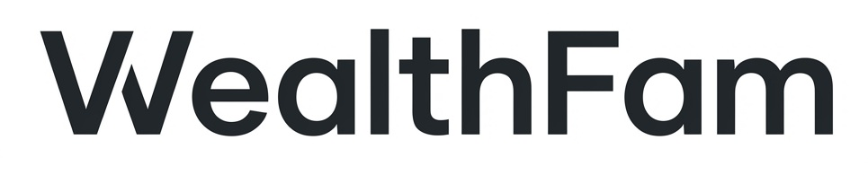

  
   
   
  
   
   
  
  &nbsp;
  

# WealthFam: The Autonomous Family Wealth Engine 🚀

WealthFam is a privacy-first, community-driven ecosystem designed to simplify family financial management through automation, intelligence, and modern engineering.

---

### 🧱 Core Architecture
We leverage a bleeding-edge tech stack to ensure high performance and absolute data privacy.

---

### 🛡️ Why WealthFam?
Most wealth management tools are either too simple for families or too invasive for privacy. WealthFam bridges that gap by offering a local-first architecture with decentralized synchronization.

- **👨‍👩‍👧‍👦 Family-Centric**: Multi-user support with role-based visibility (Adults/Kids).
- **🤖 Automation at Core**: Automated SMS-to-Transaction parsing via local AI.
- **📍 Geographic Insights**: Visualizing your spending intensity across the map.
- **🔐 Privacy First**: DuckDB-powered local storage with end-to-end encrypted sync.

---

### 🛠️ The Ecosystem
WealthFam is composed of three primary pillars:

| Component | Repository | Status |
| :--- | :--- | :--- |
| **Backend Core** | [`WealthFam-FastAPI-Backend`](https://github.com/WealthFam/WealthFam-FastAPI-Backend) |  |
| **Web Dashboard** | [`WealthFam-Vue-Web-Frontend`](https://github.com/WealthFam/WealthFam-Vue-Web-Frontend) |  |
| **Mobile App** | [`WealthFam-Mobile-Application-Flutter-`](https://github.com/WealthFam/WealthFam-Mobile-Application-Flutter-) |  |

---

### 🤝 Join the Family
WealthFam is built for families, by engineers who care about their families. We welcome contributions, bug reports, and feature requests.

- 📖 **Read our [Engineering Practices](https://github.com/WealthFam/WealthFam-FastAPI-Backend/blob/master/PRACTICES.md)**
- ✨ **Check our [Backlog](https://github.com/WealthFam/WealthFam-FastAPI-Backend/blob/master/backlog.md)** for upcoming features.
- 💬 **Follow us for updates**

---

  <i>Built with ❤️ for a wealthier, smarter family future.</i>

